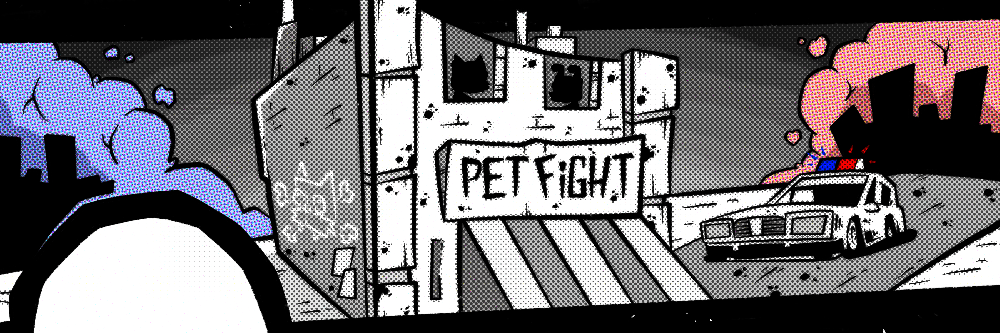

# 🚀 Join the Battle in PetFight! 🐾

### Are you ready to unleash your inner pet warrior? 
Click the button below to dive into the fun!

# PetFight: Cats vs Dogs

**PetFight** is a web application for Telegram currently in development. In our app, users can engage in exciting battles between cats and dogs, creating unique teams and competing against each other.

## Architecture

The project is built on a **microservices architecture**, allowing for flexibility and scalability.

### Technologies

- **Backend**: Python using FastAPI for fast and efficient request handling.
- **Database**: PostgreSQL, ensuring reliable storage of user data.
- **Frontend**: Flutter with Provider for creating an intuitive user interface.
- **Server**: Caddyfile for simplified web server management and routing.

## Security

User data is protected during the transition from Telegram to the application through authentication checks. This ensures that only authorized users can access the app's features.

## Links

- [Go to the Telegram Bot](https://t.me/tsucintosh)
- [Read the License](LICENSE)
- [Join Our Community on Telegram](https://t.me/petfightclub)

We welcome your feedback and suggestions!

